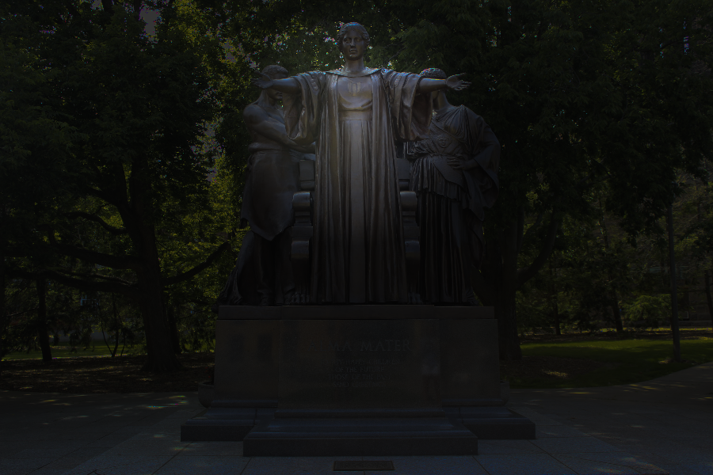

# lab_intro
This lab was the first lab of the course and useful for guidance setting up your programming environment and making sure everything works before diving into more complex code. 
It introduces students to the HSLA color definition and warms up their ability to traverse through and manipulate the pixels of an image in C++. 
The instructions for this lab can be found at https://courses.engr.illinois.edu/cs225/fa2018/labs/intro-2/  

## Edited Files
I created the cs225 namespace in [./cs225/HSLAPixel.h](https://github.com/monk200/Data_Structures/blob/main/lab_intro/cs225/HSLAPixel.h) and [./cs225/HSLAPixel.cpp](https://github.com/monk200/Data_Structures/blob/main/lab_intro/cs225/HSLAPixel.cpp) accoring to the [doxygen for HSLAPixel](https://courses.engr.illinois.edu/cs225/fa2018//doxygen/lab_intro/classcs225_1_1HSLAPixel.html)
and the createSpotlight, illinify, and watermark functions in [lab_intro.cpp](https://github.com/monk200/Data_Structures/blob/main/lab_intro/lab_intro.cpp). The other files, functions, and tests were provided for me by the course.

## Running and Testing
Compile the code by typing <code>make</code> into the linux terminal while in the lab_intro directory.
This builds the execuatable <code>lab_intro</code>, which can be used to run the <code>main</code> function by typing <code>./lab_intro</code> into the terminal.
Once this runs, the files <code>out-grayscale.png</code>, <code>out-illinify.png</code>, <code>out-spotlight.png</code>, and <code>out-watermark.png</code>
 will apply transformations to <code>alma.png</code>.
The provided test cases can be run by typing <code>make test</code> and then <code>./test</code> into the terminal.
Keep in mind that some test cases may produce different results on different computers.

## Output
Compiling the file throws two warnings in lines 67 and 69 because I compared an unsigned int to a signed int.
The file still runs, passes all 29 asserations in 8 given test cases, and produces the desired results as shown below:  
  
#### Illinify Output

#### Spotlight Output

#### Watermark Output

